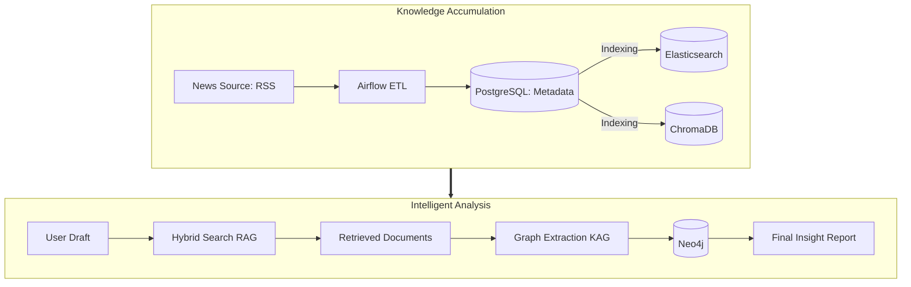

# 🗞️ 뉴스 아레나 (News Arena)

> 기사 초안이 사실에 근거하는지, 놓친 관점은 없는지 검증하는 도구.
> 매일경제 RSS를 수집해 하이브리드 RAG와 Property Graph Index로 분석합니다.

### 프로젝트 3줄 요약

- **ETL**: LLM 기반 메타데이터 추출 자동화 파이프라인 구축
- **RAG**: 하이브리드 검색(BM25 + 벡터) + RRF 알고리즘 구현
- **진단**: 지식그래프 도입 근거를 사후 검증. 결과와 한계를 [docs/design-review.md](docs/design-review.md)에 정리

---

## 무엇을 하는 도구인가

기자가 기사 초안을 씁니다. 그런데 이런 게 궁금합니다.

- 내가 쓴 내용이 실제 보도와 맞나
- 반대편 입장은 빠지지 않았나
- 이미 번복된 사실을 아직 유효한 것처럼 쓰고 있진 않나

이걸 사람이 확인하려면 관련 기사를 다 찾아 읽어야 합니다. 이 도구는 그 과정을 자동화합니다.

```
기사 초안 입력
  → 관련 보도 자동 검색
  → 사실관계 대조
  → 근거와 함께 검증 결과 반환
```

---

## 왜 지식그래프를 썼나

일반적인 검색은 **문서를 찾아옵니다.** 그런데 어떤 사실은 한 문서 안에 없습니다.

```
1월 기사   A사가 B사에 투자했다
3월 기사   B사가 C사에 납품한다
           ↓
      A사와 C사는 B사를 통해 연결된다
      (어느 기사에도 적혀 있지 않은 사실)
```

파티에서 인맥 지도를 그리는 것과 같습니다. 김씨가 이씨를 알고 이씨가 박씨를 안다면, **아무도 말해주지 않아도 김씨와 박씨의 연결이 지도에서 드러납니다.**

검색으로는 불가능하고 그래프로만 되는 연산입니다. 그래서 지식그래프를 도입했습니다.

---

## 설계 사후 검증

### 왜 다시 열었나

지식그래프를 쓴 근거는 **"AI 답변이 일관되지 않아서"**였습니다.

그런데 그 판단이 맞았는지, 도입 후 실제로 나아졌는지를 **한 번도 측정한 적이 없었습니다.** 검증되지 않은 가설 위에 인프라를 올린 상태였습니다.

그래서 프로젝트를 다시 열어 측정했습니다.

### 무엇이 문제였나

그래프를 만들어보니 하나로 이어지지 않고 **작은 조각 44개**로 흩어져 있었습니다. 기사들이 서로 연결되지 않은 겁니다.

원인 후보를 하나씩 확인했습니다.

| 확인한 것 | 방법 | 결과 |
|---|---|---|
| 기사가 너무 적어서? | 5건 → 40건 (8배) | **아니오.** 기사당 개선 없음 |
| 같은 대상을 다르게 적어서? | 표기 통일 시도 | **아니오.** 통일할 대상이 거의 없었음 |
| 관계 표현이 제각각이라? | 표현 정리 | **아니오.** 연결에 영향 없음 |
| **AI가 무엇을 뽑을지 기준이 없어서?** | — | **남은 원인** |

### 마지막 원인이 무슨 뜻인가

사실을 추출하는 AI에게 **"무엇이 대상인가"를 정의해주지 않았습니다.** 그러니 인명·회사명뿐 아니라 날짜, 금액, 심지어 문장 조각까지 대상으로 등록했습니다.

`2025년 펀드시장 결산` 같은 게 하나의 "대상"이 되어 있었습니다. **그건 다른 기사에 나올 수가 없습니다.** 그 문장에만 존재하니까요.

그리고 이게 두 번째 문제를 만들었습니다.

```
대만 배우 부고 기사  ──?──  국내 ETF 펀드 기사
```

이 둘이 연결돼 있었습니다. 다리가 뭐였냐면 **`5년`이라는 글자**입니다. `2025년`이라는 단어 안에 `5년`이 들어 있어서요.

명함첩에서 "김철수"와 "박철수"를 뒤에 "철수"가 붙었다는 이유로 같은 사람으로 합친 것과 같습니다.

### 아직 모르는 것

원인을 좁혔지만 **확정하지 않았습니다.**

수집한 기사 40건이 9개 분야에 흩어진 이틀치라, 애초에 서로 무관한 기사들이었을 가능성이 남습니다. 추출 방식 문제와 기사 구성 문제가 이 데이터로는 분리되지 않습니다.

한계 6가지를 [docs/design-review.md](docs/design-review.md) §7.2에 정리했습니다.

---

## 다음 계획

우선순위 순입니다.

1. **날짜·숫자를 "대상"에서 제외** — 표준 지식그래프에서 날짜는 대상이 아니라 속성입니다. 정규식으로 처리 가능하며 재추출이 필요 없습니다.
2. **추출 방식 교체** — AI에게 자유롭게 뽑게 하는 대신, 허용 유형(인물/조직/장소/제품)을 미리 정해주는 방식으로 바꾸고 재측정합니다.
3. **주제 집중 코퍼스로 재검증** — 이번에 확인된 건 "분야가 흩어진 기사를 늘려도 소용없다"입니다. 같은 주제를 추적한 기사에서는 다를 수 있습니다.
4. **비교 기준 확보** — 재등장률 9.2%가 정말 낮은 값인지 판단할 동종 시스템 수치가 없습니다.

---

## 이 저장소에서 볼 것

| 문서 | 내용 |
|---|---|
| [docs/design-review.md](docs/design-review.md) | **진단 전문.** 측정 방법, 결과, 한계 6가지 |
| [docs/CONTEXT.md](docs/CONTEXT.md) | 작업 맥락과 발견 20건 |
| [DATA.md](DATA.md) | 데이터 포함 범위와 재현 방법 |

### 수치 검증

```bash
python scripts/verify_metrics.py
```

design-review의 수치를 저장소 데이터로 재계산합니다. 8개 지표 중 7개가 baseline과 완전히 일치하며, `cross_doc_path_ratio`만 0.45% 오차가 있습니다 — 원 계산 스크립트를 커밋하지 않아 발생한 재현 한계입니다(CONTEXT.md 발견 20). 이 오차는 어떤 판정 구간도 넘지 않습니다.

---

## 🏗 시스템 아키텍처

전체 시스템은 **"데이터 수집 - 축적 - 검색 - 관계 분석"**의 4단계 엔드투엔드 파이프라인으로 구성되어 있습니다.


```mermaid
graph TD
    subgraph Row1 [Knowledge Accumulation]
        direction LR
        A[News Source: RSS] --> B[Airflow ETL] --> C[(PostgreSQL: Metadata)]
        C -- "Indexing" --> D[(Elasticsearch)]
        C -- "Indexing" --> E[(ChromaDB)]
    end

    subgraph Row2 [Intelligent Analysis]
        direction LR
        F[User Draft] --> G[Hybrid Search RAG]
        G --> H[Retrieved Documents]
        H --> I[Graph Extraction KAG]
        I --> J[(Neo4j)]
        J --> K[Final Insight Report]
    end

    Row1 ==> Row2
```

---

## 🚀 주요 핵심 기술

### 1. 지능형 워크플로우 (LangGraph)

- **분석적 루프**: `LangGraph`를 사용하여 [기사 분석 → 검색 관점 도출 → 하이브리드 검색 → 그래프 기반 추론 → 최종 리포트]로 이어지는 결정적 워크플로우를 관리합니다.
- **다차원 분석(Decomposition)**: 입력 기사를 인물, 기업 전략, 시장 반응 등 다각도의 페이셋(Facets)으로 분해하여 보다 정밀한 검색을 수행합니다.

### 2. 커스텀 하이브리드 리트리버 (LangChain & RRF)

- **Ensemble Retrieval**: Elasticsearch의 **Sparse(BM25)** 검색과 ChromaDB의 **Dense(Vector)** 검색을 결합합니다.
- **RRF (Reciprocal Rank Fusion)**: 순수 알고리즘 구현(`Score = Σ 1/(rank + 60)`)으로 두 검색 결과를 통합합니다.

> **측정 현황**: PoC 데이터셋 기준 Context Precision 1.0을 기록했으나, 당시 색인된 문서가 5건이었으므로 천장 효과 가능성이 높고 개선 측정에는 기여하지 않는 값입니다. 또한 파이프라인에는 변동이 발생하는 층이 5개(메타데이터 추출 / 분해 / 검색 / 트리플 추출 / 리포트 생성) 있으며, RAGAS는 그중 검색 층만 측정합니다. 상세는 [docs/design-review.md](docs/design-review.md) 참고.

### 3. Graph Intelligence (LlamaIndex PGI)

- **JIT 지식 그래프**: 검색된 우량 문서들로부터 즉석에서 엔티티와 관계(Triplets)를 추출하여 `PropertyGraphIndex`를 구축합니다.
- **순수 격리 분석(Isolation)**: 사용자 초안과 검증된 소스를 격리 대조하여 정보의 **모순(Contradiction)**을 탐지하는 구조를 구현했습니다. 제어 효과 자체는 측정되지 않았습니다.

---

## 📊 육각형 분석 (재설계 진행 중)

6개 지표를 구현했으나, 이번 사후 검증에서 이 지표들이 **목적(기사의 객관성·관점 신규성)에서 유도된 것이 아니라 그래프가 계산할 수 있는 것에서 유도됐음**을 확인했습니다. 예를 들어 Connectivity가 높은 기사가 좋은 기사인지는 정의된 바 없습니다.

또한 지표 산출의 전제인 트리플 추출 자체에 문제가 있음이 드러나([docs/design-review.md](docs/design-review.md) 참고) 현재 지표 체계를 재설계 중입니다. 아래 표는 현재 구현 상태를 기록한 것입니다.

| 지표명 | 주요 로직 | 목적 |
|---|---|---|
| **Connectivity** | 네트워크 밀도 측정 | 엔티티 간 복합적 관계망 파악 |
| **Factuality** | LLM Grounding Confidence | 데이터의 정형화 및 검증 가능성 |
| **Depth** | Multi-hop 경로 복잡도 | 사건의 인과관계 및 심층성 측정 |
| **Originality** | 신규 노드/관계 기여도 | 기존 DB 대비 고유 정보 가치 |
| **Density** | 정보 압축률 | 핵심 사건 정보의 밀집도 |
| **Insight** | 주제 적합성 및 통찰력 | 사용자 의도에 대한 해답 제공 |

---

## 🛠 실행 방법

### 1. 서비스 가동 (Docker)

```bash
docker-compose up -d
```

### 2. 하이브리드 분석 데모 실행

```bash
PYTHONPATH=. uv run python3 main_hybrid_demo.py
```

### 3. RAG 성능 평가 실행

```bash
PYTHONPATH=. uv run python3 app/rag/evaluator.py
```

### 4. 진단 지표 재계산

```bash
python scripts/verify_metrics.py
```

---

## 📂 프로젝트 구조

- **`app/etl/`**: 데이터 수집, 메타데이터 추출, 가상 동기화 모듈
- **`app/rag/`**: 하이브리드 리트리버, LangGraph 워크플로우, RAGAS 평가
- **`app/graph/`**: JIT 지식 그래프 빌더 및 육각형 분석 엔진
- **`dags/`**: Airflow 파이프라인 오케스트레이션 정의
- **`scripts/`**: 진단 파이프라인 (Stage 1/2 색인, 정규화, 지표 검증)
- **`experiments/`**: 측정 지점별 그래프 산출물
- **`tests/fixtures/`**: 측정 지점별 지표 baseline
- **`docs/`**: 진단 문서 — design-review.md, CONTEXT.md
- **`technical_report.md`**: 2026-02 시점 기술 고찰 및 트러블슈팅 이력
