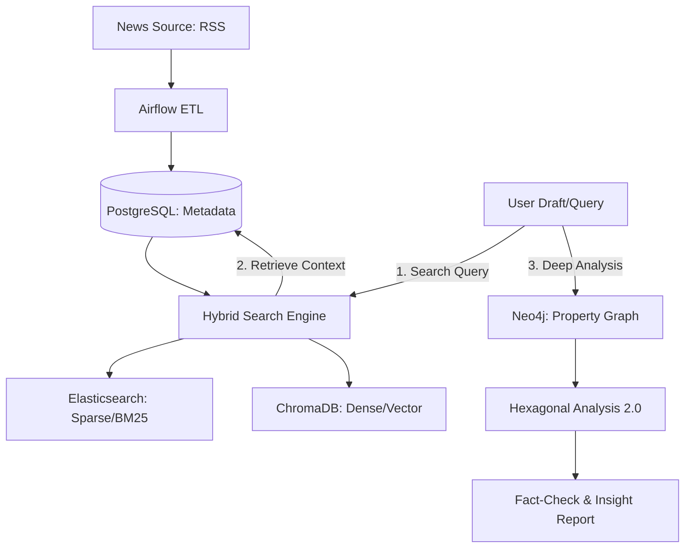

# 🗞️ 뉴스 아레나 (News Arena)
> **AI 기반 지능형 뉴스 RAG & Property Graph Analysis 파이프라인**

이 프로젝트는 매일경제 RSS 피드에서 뉴스를 수집하여 **AI(Claude)를 활용한 지능형 분석(Transform)**을 수행하고, **하이브리드 RAG와 Property Graph Index(PGI)를 결합**하여 심층적인 통찰을 제공하는 차세대 뉴스 지능 엔진입니다.

---

## 🏗️ 시스템 아키텍처 (System Architecture)

전체 시스템은 **"데이터 수집-축적-검색-관계 분석"**의 4단계 엔드투엔드 파이프라인으로 구성되어 있습니다.



---

## 🚀 주요 핵심 기술 (Key Pillars)

### 1. 지능형 워크플로우 (LangGraph)
- **분석적 루프**: `LangGraph`를 사용하여 [기사 분석 -> 검색 관점 도출 -> 하이브리드 검색 -> 그래프 기반 추론 -> 최종 리포트]로 이어지는 결정적 워크플로우를 관리합니다.
- **다차원 분석(Decomposition)**: 입력 기사를 인물, 기업 전략, 시장 반응 등 다각도의 페이셋(Facets)으로 분해하여 보다 정밀한 검색을 수행합니다.

### 2. 커스텀 하이브리드 리트리버 (LangChain & RRF)
- **Ensemble Retrieval**: Elasticsearch의 **Sparse(BM25)** 검색과 ChromaDB의 **Dense(Vector)** 검색을 결합합니다.
- **RRF (Reciprocal Rank Fusion)**: 순수 알고리즘 구현(`Score = Σ 1/(rank + 60)`)을 통해 검색 정밀도(**Context Precision 1.0**)를 실현했습니다.

### 3. Graph Intelligence (LlamaIndex PGI)
- **JIT 지식 그래프**: 검색된 우량 문서들로부터 즉석에서 엔티티와 관계(Triplets)를 추출하여 `Neo4j`에 `PropertyGraphIndex`를 구축합니다.
- **순수 격리 분석(Isolation)**: 사용자 초안과 검증된 소스를 격리 대조하여 정보의 **모순(Contradiction)**을 탐지하는 팩트체크 환경을 제공합니다.

---

## 📊 육각형 분석 2.0 (Hexagonal Metrics)

단순 텍스트 요약을 넘어, 지식 그래프의 네트워크 통계와 LLM의 정성 평가를 결합한 6대 지표를 산출합니다.

| 지표명 | 주요 로직 | 목적 |
| :--- | :--- | :--- |
| **Connectivity** | 네트워크 밀도 측정 | 엔티티 간 복합적 관계망 파악 |
| **Factuality** | LLM Grounding Confidence | 데이터의 정형화 및 검증 가능성 |
| **Depth** | Multi-hop 경로 복잡도 | 사건의 인과관계 및 심층성 측정 |
| **Originality** | 신규 노드/관계 기여도 | 기존 DB 대비 고유 정보 가치 |
| **Density** | 정보 압축률 | 핵심 사건 정보의 밀집도 |
| **Insight** | 주제 적합성 및 통찰력 | 사용자 의도에 대한 해답 제공 |

---

## � 성능 평가 결과 (Evaluation)

`RAGAS` 지표를 통해 하이브리드 전략의 우수성을 객관적으로 입증했습니다.

- **Context Precision**: **1.0** (필요한 정보가 항상 상위에 노출됨)
- **Faithfulness**: LLM 기반 사실 충실도 검증 통과
- **Fact-Check Accuracy**: 실제 사례(예: 강영권 회장 선고 형량 대조)에서 **Contradiction** 탐지 성공

---

## 🛠 실행 방법 (Getting Started)

### 1. 서비스 가동 (Docker)
```bash
docker-compose up -d
```

### 2. 하이브리드 분석 데모 실행
```bash
PYTHONPATH=. uv run python3 main_hybrid_demo.py
```

### 3. RAG 성능 평가 실행
```bash
PYTHONPATH=. uv run python3 app/rag/evaluator.py
```

---

## 📂 프로젝트 구조
- **`app/etl/`**: 데이터 수집, 메타데이터 추출, 가상 동기화 모듈
- **`app/rag/`**: 하이브리드 리트리버, LangGraph 워크플로우, RAGAS 평가
- **`app/graph/`**: JIT 지식 그래프 빌더 및 육각형 분석 엔진
- **`dags/`**: Airflow 파이프라인 오케스트레이션 정의
- **`technical_report.md`**: 상세 기술 고찰 및 트러블슈팅 이력

