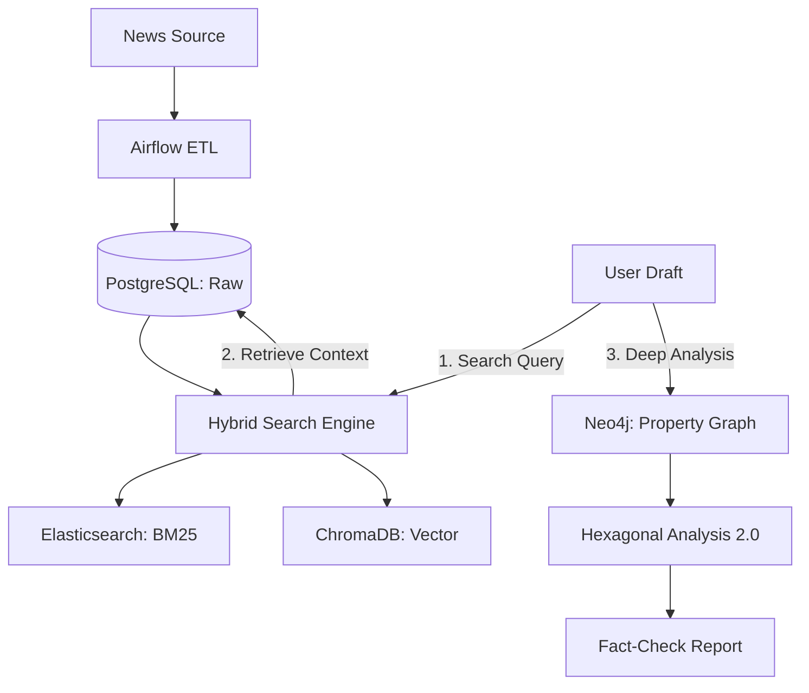

# 🗞️ 뉴스 아레나(News Arena) 종합 기술 리포트

본 문서는 뉴스 수집(ETL)부터 지능형 그래프 분석(GraphRAG)을 통한 팩트체크 파이프라인의 구축 과정과 기술적 고찰을 정리한 리포트입니다.

---

## 🏗️ 시스템 아키텍처 개요
전체 시스템은 **"데이터 수집-축적-검색-관계 분석"**의 4단계 파이프라인으로 구성되어 있습니다.

---

## 🛠️ 기술 스택 (Tech Stack)

### 1. ETL & Storage
*   **Orchestration**: `Apache Airflow` (Docker-based)
*   **Database**: `PostgreSQL` (Metadata), `SQLite` (Local Dev)
*   **Search**: `Elasticsearch` (Keyword), `ChromaDB` (Semantic)
*   **Enrichment**: `LlamaIndex`를 활용한 Semantic Chunking 및 메타데이터 추출

### 2. Intelligent RAG
*   **Hybrid RAG (Custom RRF)**: `BM25` + `Vector Search`를 결합. LangChain의 `BaseRetriever`를 상속받아 **Reciprocal Rank Fusion(RRF)** 알고리즘을 직접 구현하여 키워드 정합성과 의미론적 유사성을 동시에 확보.
    *   **RRF Formula**: `Score = Σ (1 / (rank + 60))`
*   **Evaluation (RAGAS)**: `Context Precision` 지표를 중심으로 평가 수행. 하이브리드 전략 도입 후 **Context Precision 1.0** 달성.
*   **Multi-Query**: LLM을 통한 질의 확장(Decomposition)으로 검색 누락 방지.

### 3. Graph Intelligence (The Core)
*   **Graph DB**: `Neo4j` (Property Graph Index)
*   **Knowledge Extraction**: `SimpleLLMPathExtractor` (LlamaIndex)
*   **Analysis Engine**: 
    *   **Text-to-Cypher**: 자연어 질문을 Neo4j 전용 쿼리로 변환.
    *   **Hexagonal Metrics 2.0**: 6가지 정량 지표 산출.

---

## 📊 육각형 분석 2.0 지표 계산 로직 (Metric Calculation)

각 지표는 Neo4j의 그래프 통계와 LLM의 정성적 평가를 결합하여 산출됩니다.

| 지표명 | 계산 방식 및 로직 | 목적 |
| :--- | :--- | :--- |
| **Connectivity** | `(전체 관계 수 / 전체 노드 수) * 10`, Max 100 | 엔티티 간의 네트워크 밀도와 영향력 측정 |
| **Factuality** | LLM 기반 검증 가능한 사실(Triplets) 밀도 평가 (0~100) | 데이터의 구체성 및 상호 검증 가능성 판별 |
| **Depth** | `(2-hop 이상 경로 수) * 5`, Max 100 | 다단계 전이 관계의 복잡성과 깊이 측정 |
| **Originality** | 지식 베이스 기여도 및 신규 정보 비중 평가 | 중복되지 않는 새로운 지식의 가치 측정 |
| **Density** | `(결과 내 관계 수 / 결과 내 유니크 노드 수) * 20` | 특정 답변 범위 내의 정보 실질적 밀도 측정 |
| **Insight** | LLM 기반 질문의 핵심 답변 적합성 평가 (0~100) | 데이터가 사용자에게 주는 질적 통찰력 측정 |

---

## 🎯 해결된 사용자 시나리오 (Pure Isolated Fact-Check)
사용자가 작성 중인 기사 초안을 기존 검증된 지식과 대조하는 **"순수 격리 분석"** 환경을 구축했습니다.

1.  **검색(RAG)**: 사용자 기사 키워드로 기존 DB에서 유사도가 높은 기사를 검색.
2.  **격리 저장(Isolation)**: Neo4j를 초기화한 뒤, 검색된 기사의 지식만 `:VerifiedSource` 라벨로 저장.
3.  **대조 분석(Comparison)**: 사용자 기사의 관계망(Triplets)을 추출하여 `VerifiedSource`와 1:1 대조.
4.  **결과 도출**: 징역 형량(3년 vs 5년)과 같은 직접적 모순 탐지 및 신규 정보 식별.

---

## 🛑 트러블슈팅 이력 (Issue Log)

| 발생 단계 | 이슈 내용 | 원인 | 해결 방안 |
| :--- | :--- | :--- | :--- |
| **인프라** | **Docker OOM (Exit 137)** | ES, Neo4j, Airflow 동시 가동 시 메모리 부족 | ES Java Heap 1GB 증설 및 시스템 정리 |
| **Elasticsearch** | **Index Missing Error** | 도커 컨테이너 재생성 시 인덱스 휘발 | `migrate_to_es.py` 자동 마이그레이션 도구 구축 |
| **Graph** | **Schema Mismatch (PGI)** | LlamaIndex 0.14+의 `acall` 비동기 인터페이스 변화 | `extract` 대신 `await acall` 메서드로 교체 |
| **Logic** | **Fact-Check Hallucination** | LLM 프롬프트에 대조군 데이터 부족 | Neo4j에서 대조 지식을 명시적 추출하여 프롬프트 주입 |
| **Data** | **지식 섞임 현상** | 이전 분석 기사가 그래프에 누적되어 분석 방해 | 분석 시마다 `DETACH DELETE` + 전용 라벨링 적용 |
| **Search** | **Empty Results** | LLM이 너무 엄격한 Cypher 쿼리(중복 관계 필터) 생성 | 프롬프트 튜닝을 통해 쿼리 유연성 확보 |

---

## 📈 발전 방향 (Future Tasks)
1.  **가성비 튜닝**: 사용하지 않는 Airflow 서비스를 선택적으로 가동하는 `Docker Profile` 도입.
2.  **멀티 세션**: 여러 사용자가 동시에 분석할 때 데이터가 섞이지 않도록 `graph_id` 기반 멀티 테넌시 구현.
3.  **시각화 고도화**: Neo4j Browser를 넘어 리액트 기반의 **인터랙티브 대시보드(Radar Chart)** 연동.

---
> [!TIP]
> **성공 요인**: 단순한 RAG(문서 검색)를 넘어, 데이터를 **지식 소자(Triple)**로 분해하고 이를 그래프 상에서 물리적으로 대조함으로써 LLM의 할루시네이션(환각)을 원천 봉쇄한 것이 본 프로젝트의 핵심 성과입니다.
